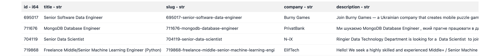
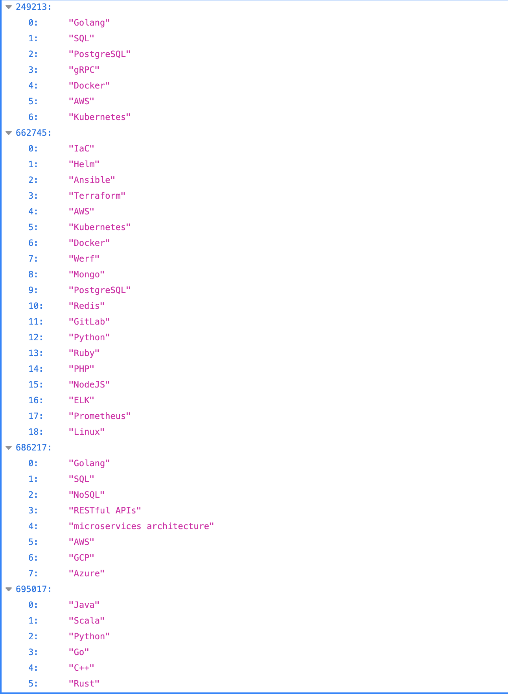

# tech-skills-insights

This project collects job listings from [djinni.co](https://djinni.co) and uses the OpenAI API to extract keywords from job descriptions for future analysis.

The two main modules are deployed as **AWS Lambda functions**:
- **Job scraping** runs **daily**, collecting fresh raw data
- **Keyword extraction** runs **every Sunday**, processing the raw descriptions from the week

## Current Features

- Scrapes job listings from [djinni.co](https://djinni.co)
- Saves:
  - Job title  
  - Description  
  - Salary (if available)  
  - Tech stack / tags  
  - Job URL
  - ...
- Extracts relevant keywords from each job description using OpenAI's GPT model

## Project Structure

- `data_parser.py` — collects job data and uploads it to AWS S3 in **Parquet** format  
- `extract_keywords.py` — extracts keywords and stores them in **JSON** format on S3

## Data Storage

- Job listings are saved in `.parquet` format
- Extracted keywords are saved in `.json` format
- All files are stored in a specified AWS S3 bucket
- Example data structure:
  ```
  s3://bucket-name/
    ├── djinni/
    │   └── date=2025-03-05/
    │       ├── eb7c1249ffe1403293d74ab478b6f39d-0.parquet
    │       └── keywords.json
  ```

## Output example:

`eb7c1249ffe1403293d74ab478b6f39d-0.parquet`


The screenshot below shows a sample of extracted keywords stored in `keywords.json`.

Each **key** is a job post ID from [djinni.co](https://djinni.co), and each **value** is a list of relevant keywords automatically extracted from that job's description using the OpenAI API.

`keywords.json`


> You can check the [`attachments/data`](attachments/data) folder for sample output files.

## Planned Features

- Analyze collected job data:
  - Most frequent keywords and technologies
  - Tech trends over time (based on job posting dates)
  - Keywords (skills) clustering using ML models
  - Visual dashboards

## Usage

1. **Scrape jobs**:
   ```bash
   python data_parser.py
   ```

2. **Extract keywords** (requires OpenAI API key):
   ```bash
   python extract_keywords.py
   ```

3. Output files will be automatically saved to your configured S3 bucket.

## Requirements

- Python 3.9+
- AWS credentials configured (via `boto3`)
- OpenAI API key
- Required libraries:
  - `requests`, `beautifulsoup4`, `pandas`, `pyarrow`, `openai`, `boto3`, `s3fs`, `emoji`

## Technologies Used

- **Language**: Python 3
- **Web scraping**: `requests`, `BeautifulSoup`
- **Keyword extraction**: OpenAI GPT API (`gpt-4o-mini` or configurable)
- **Data processing**: `pandas`, `pyarrow`
- **Storage**: AWS S3 (`boto3`, `s3fs`)

---

> Project is in early development. Focus is on collecting clean, structured data. Analytical tools are coming soon.  
> Keyword extraction currently uses the gpt-4o-mini model via the OpenAI API, but you can switch to any other model since the raw job data is stored unmodified in Parquet format.
