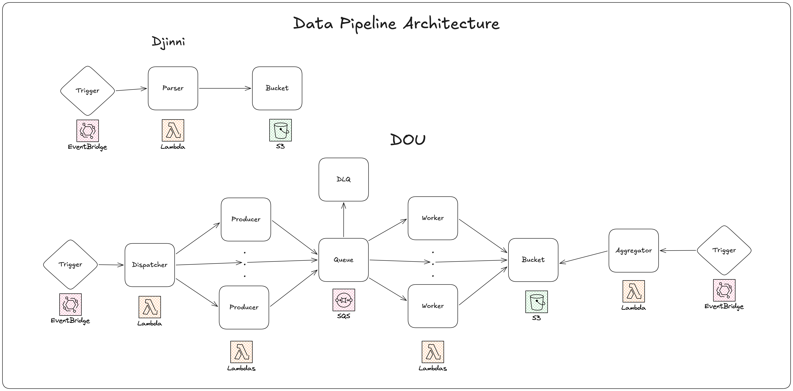
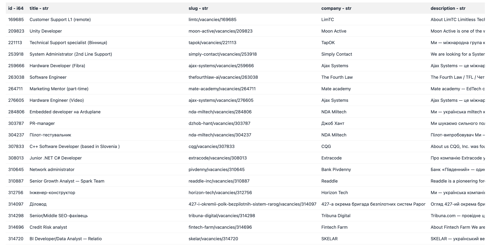
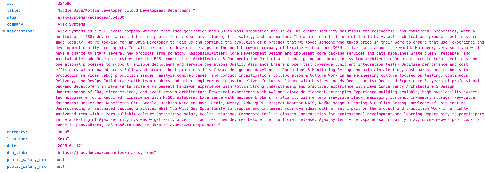

# tech-skills-insights

A Python data pipeline designed to collect, process, and store tech job market data from [djinni.co](https://djinni.co) and [jobs.dou.ua](https://jobs.dou.ua).

This project automates data collection using **AWS Lambda**, **Amazon SQS**, **DynamoDB**, and **S3**.

## Architecture Overview

Because the target websites work differently, the data collection is split into two approaches:

- **Djinni:** Provides an API, so a single Lambda function is enough to fetch the data.
- **DOU:** Requires web scraping. To handle large volumes of pages and avoid AWS Lambda's 15-minute timeout, the process is split into smaller tasks using an SQS queue.

Automated tasks are triggered via Amazon EventBridge **daily at 4:00 AM (Kyiv time)**. This schedule ensures we get fresh data while minimizing the load on the websites during their off-peak hours.

### System Flow



### Components

1. **Dispatcher (`dou_dispatcher.py`)**: A cron-triggered Lambda that acts as an orchestrator. It fetches the last processed date from DynamoDB and triggers Producer functions for each specific tech category (e.g., Python, Java, DevOps).
2. **Producer (`dou_producer.py`)**: Handles pagination on the target website, extracts job URLs, and sends them to the Amazon SQS queue.
3. **Worker (`dou_worker.py`)**: Reads URLs from the SQS queue, scrapes the actual web pages (titles, salaries, descriptions), and saves the raw data as JSON files to S3.
4. **Aggregator (`dou_aggregator.py`)**: Processes the collected data day by day, combining all raw JSON files from a specific date into a single, optimized Parquet file. It uses recursion to safely bypass the 15-minute execution timeout.
5. **Djinni Parser (`djinni_parser.py`)**: A standalone Lambda function that fetches job data directly via the Djinni API and saves it to S3.

## Scraping & Reliability Details

To make the web scraping stable, the project uses several techniques:

- **SQS & DLQ**: If a page fails to load, the system retries. If it fails repeatedly, the message goes to a **Dead Letter Queue (DLQ)** for manual check without stopping the whole pipeline.
- **URL Encoding**: Handles complex query parameters (like `C++` -> `C%2B%2B`) and Cyrillic headers to prevent encoding crashes.
- **Rate Limiting**: Uses random delays and HTTP headers to mimic human browsing and avoid being blocked by servers.
**Recursive Timeouts**: The Aggregator tracks its own AWS Lambda execution time and recursively self-invokes if it approaches the timeout limit, ensuring massive datasets are processed without interruption.

## Data Storage

Data is stored in an AWS S3 bucket. DynamoDB is used to track the last processed dates.

- **Raw Data:** JSON format (unmodified data directly from the websites).
- **Processed Data:** `.parquet` format (cleaned and partitioned by date). Parquet is used because it's optimized for future SQL database integration.

### S3 Bucket Structure

```text
s3://bucket-name/
  ├── djinni/
  │   └── processed/
  │       └── date=2025-03-05/
  │           └── [file_hash].parquet
  └── dou/
      ├── raw/
      │   └── date=2025-03-05/
      │       ├── [job_id_1].json
      │       └── [job_id_2].json
      │
      └── processed/
          └── date=2025-03-05/
              └── dou_2025-03-05.parquet
```

## Planned: Keyword Extraction

*Note: Keyword extraction was tested in an earlier version and is temporarily paused while the core infrastructure is stabilized.*

In the future, the collected raw job descriptions will be processed externally to extract specific tech skills using LLMs. Depending on costs and performance, I might continue using the OpenAI API or experiment with open-source models (e.g., Llama 3 or Mistral running in Google Colab/Kaggle). Below are examples of the expected output.

**Djinni Job Listings Example (Parquet):**


**Djinni Extracted Keywords Example (JSON):**
Each key is a job post ID, and each value is a list of relevant tech skills extracted from the description.


**DOU Job Listings Example (Parquet):**


**DOU Raw File Example (JSON):**


> You can check the [`attachments/data`](attachments/data) folder for sample output files.

## Initial Setup & Backfill

If you deploy this for the first time, you might want to fetch historical data:

### DOU Pipeline

The DOU pipeline handles backfilling automatically. If DynamoDB is empty, it will start fetching historical data using the SQS queues.

### Djinni Pipeline

Since the Djinni parser is just one Lambda function, downloading months of historical data at once might trigger the 15-minute AWS timeout.

To avoid this on your first run:

- **Option 1 (Recommended):** Run `djinni_parser.py` locally on your computer. This ignores the AWS time limit and saves all active jobs directly to S3.
- **Option 2:** If you want to run it in AWS, temporarily change the start date in the code (replace `1970-01-01` with a more recent date, like 2 weeks ago) so it finishes faster.

## Roadmap & Planned Features

- **Infrastructure as Code (IaC):** Add **Terraform** to automate the creation of AWS resources (Lambdas, SQS, DynamoDB, S3).
- **SQL Database Integration:** Load the Parquet data into a relational SQL database for easier querying.
- **Keyword Extraction (LLM):** Implement a separate script to read the raw job descriptions and extract specific technologies. The exact approach is to be decided — it could involve using the OpenAI API as in the past or running open-source models in **Google Colab** or **Kaggle Notebooks** to optimize costs.
- **Data Analytics:** Build visual dashboards to track framework popularity and salary trends over time.

## Requirements

- Python 3.12+
- AWS credentials configured (via `boto3`)
- Required libraries:
  - `requests`, `beautifulsoup4`, `pandas`, `pyarrow`, `boto3`, `s3fs`, `emoji`

## Technologies Used

- **Cloud**: AWS (Lambda, SQS, S3, DynamoDB, EventBridge)
- **Language**: Python 3
- **Data Processing**: `pandas`, `pyarrow`
- **Web Scraping**: `requests`, `BeautifulSoup4`
- **Text Cleaning**: `emoji`
- **AWS Integration**: `boto3`, `s3fs`
