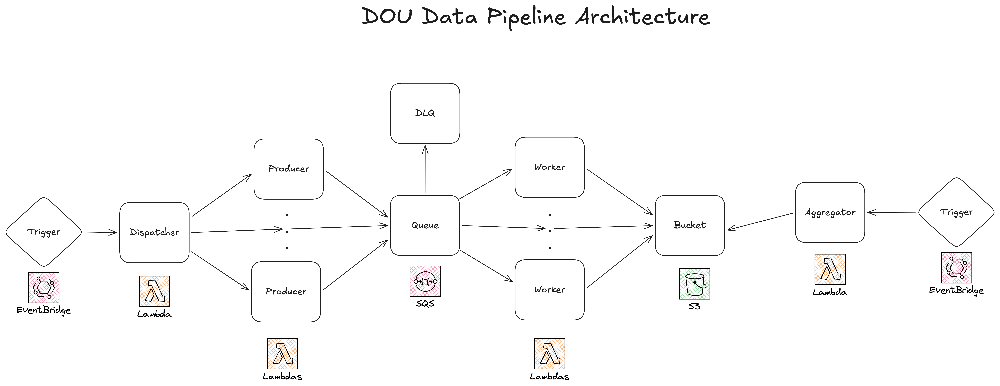
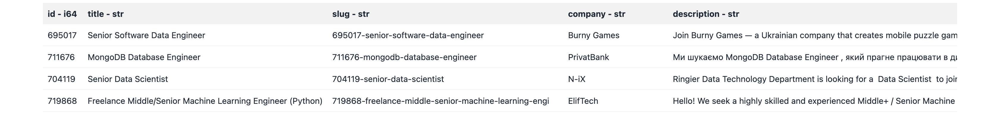
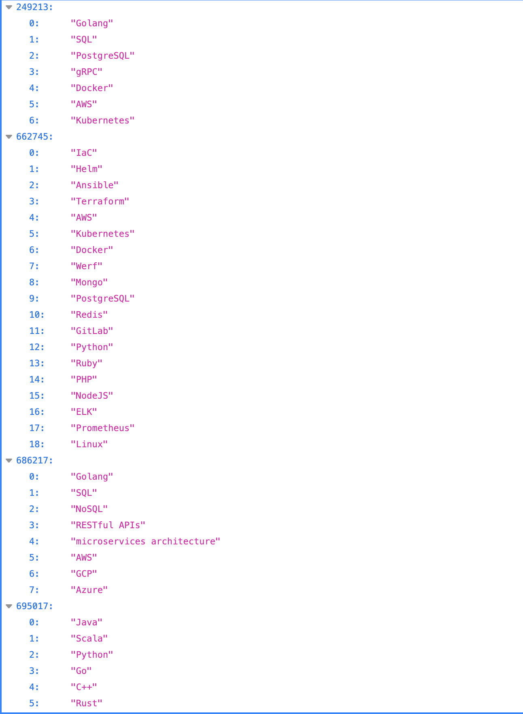

# tech-skills-insights

A resilient, event-driven serverless data pipeline designed to collect, process, and analyze tech job market data from [djinni.co](https://djinni.co) and [jobs.dou.ua](https://jobs.dou.ua).

This project has migrated to a **v2.0 architecture**, transitioning from standalone scripts to a fully decoupled AWS microservices ecosystem using **AWS Lambda**, **Amazon SQS**, **DynamoDB**, and **S3**.

## Architecture Overview

The data collection process is fully asynchronous and distributed to handle large volumes of data and safely bypass anti-bot mechanisms.

Automated tasks are triggered via Amazon EventBridge **daily at 4:00 AM (Kyiv time)**. This specific schedule ensures fresh data collection for the day while minimizing the server load on the target websites during their off-peak hours.

### System Flow
```text
EventBridge (4:00 AM Kyiv)
       │
       ├──> [Djinni Parser Lambda] <──> DynamoDB (State)
       │                 │
       │                 └──> S3 (Processed Parquet)
       │
       └──> [DOU Dispatcher Lambda] <──> DynamoDB (State)
                   │
                   └──> [DOU Producer Lambdas] ──> SQS Queue ──> (DLQ)
                                                       │
                          S3 (Raw JSON) <── [DOU Worker Lambdas]
                               │
EventBridge (5:00 AM Kyiv) ──> [DOU Aggregator Lambda] <──> DynamoDB (State)
                               │
                               └──> S3 (Processed Parquet)
```



### Components
1. **Dispatcher (`dou_dispatcher.py`)**: A cron-triggered Lambda that acts as an orchestrator. It fetches the last processed date from DynamoDB and triggers Producer functions for each specific tech category (e.g., Python, Java, DevOps).
2. **Producer (`dou_producer.py`)**: Handles category-specific AJAX pagination on the target website. It safely extracts job URLs, formats them, and pushes messages in batches to an Amazon SQS queue.
3. **Worker (`dou_worker.py`)**: Consumes URLs from the SQS queue. It acts as the actual web scraper, navigating to individual job postings, extracting raw data (titles, salaries, descriptions), and dumping the raw JSONs into an S3 bucket.
4. **Aggregator (`dou_aggregator.py`)**: A recursive Lambda function designed to safely bypass the 15-minute execution timeout when processing large datasets. It sweeps through the raw JSONs in S3, cleans the data, casts data types using `pandas`, and converts the daily batches into highly optimized Parquet files. These files act as a reliable staging format before ultimately loading the data into an SQL database.
5. **Djinni Parser (`djinni_parser.py`)**: A standalone Lambda function dedicated to extracting job data directly via the Djinni API, saving the output directly to S3.

## Resilience & Anti-Bot Measures
Building a reliable scraping pipeline requires handling unpredictable web environments. This project features:
- **Decoupling via SQS & DLQ**: Ensures that if a single page fails to load, the entire pipeline doesn't crash. Failed messages are automatically retried. If a message fails repeatedly (e.g., due to a broken layout or persistent CAPTCHA), it is safely routed to a **Dead Letter Queue (DLQ)** for manual inspection without blocking the main parsing flow.
- **Smart URL Encoding**: A custom encoding strategy (`urllib.parse`) that handles complex ASCII categories (like `C++` -> `C%2B%2B`) for query parameters and Cyrillic categories for HTTP headers, preventing encoding errors.
- **Rate Limiting Management**: Built-in randomized delays and HTTP header spoofing to mimic human browsing behavior and respect target servers' rate limits.
- **Recursive Timeouts**: The Aggregator tracks its own AWS Lambda execution time and recursively self-invokes if it approaches the timeout limit, ensuring massive datasets are processed without interruption.

## Data Storage

Data is stored in an AWS S3 bucket with a structured hierarchy separating raw dumps from processed staging data. DynamoDB is used for state management (tracking last processed dates).

- **Raw Data:** JSON format (stored per job ID).
- **Processed Data:** Compressed `.parquet` format (partitioned by `date=YYYY-MM-DD`).

### S3 Bucket Structure
```text
s3://your-bucket-name/
  ├── djinni/
  │   └── processed/
  │       └── date=2025-03-05/
  │           └── [file_hash].parquet
  └── dou/
      ├── raw/
      │   └── date=2025-03-05/
      │       ├── [job_id_1].json
      │       └── [job_id_2].json
      │
      └── processed/
          └── date=2025-03-05/
              └── dou_2025-03-05.parquet
```

## Keyword Extraction (Status)

*Note: Keyword extraction was available in v1.0 and is temporarily paused in the current v2.0 pipeline while the core infrastructure is stabilized.*

In the future, the pipeline will reintroduce automatic keyword and tech stack extraction from raw job descriptions. This will be done using LLMs (either via open-source models or managed APIs). Below are examples of the expected output format once re-implemented.

**Job Listings Example (Parquet):**


**Extracted Keywords Example (JSON):**
Each key is a job post ID, and each value is a list of relevant tech skills extracted from the description.


> You can check the [`attachments/data`](attachments/data) folder for sample output files.

## Initial Setup & Backfill

If you are deploying this pipeline for the first time, you may want to collect historical data before relying on the daily automated triggers.

### DOU Pipeline
The DOU collection process is fully decoupled and handles backfilling automatically in the cloud. If no initial date is found in your DynamoDB state table, the architecture will automatically fetch and process the historical data using the SQS queues without requiring any manual intervention.

### Djinni Pipeline
Because the Djinni parser operates as a single, standalone Lambda function, fetching months of historical data in one run can cause it to hit the strict 15-minute AWS Lambda timeout limit. 

To safely perform the initial backfill for Djinni, you have two options:
- **Recommended (Local Run):** Run the `djinni_parser.py` script locally on your machine for the very first execution. This bypasses AWS time limits and easily fetches all currently active jobs (usually spanning the last 1-2 months) directly to your S3 bucket.
- **Cloud Run (Requires modification):** If you must run the initial backfill via AWS Lambda, you should temporarily edit the fallback date in `djinni_parser.py` (change `1970-01-01` to a more recent date, such as 2-3 weeks ago) to ensure the function completes within the 15-minute execution window.

## Roadmap & Planned Features

- **Infrastructure as Code (IaC):** Migrating all AWS infrastructure (Lambdas, IAM Roles, SQS, DynamoDB, S3) to **Terraform** for reproducible deployments.
- **SQL Database Integration:** Loading the staged Parquet data into a relational SQL database for advanced querying and data management.
- **Cost-Effective LLM Keyword Extraction:** Implementing tech stack keyword extraction. While using commercial APIs (like OpenAI) remains an option, the project aims to utilize open-source LLMs (e.g., Llama 3 or Mistral) running on environments like **Google Colab** or **Kaggle Notebooks** to reduce costs.
- **Data Analytics:** Building visual dashboards and clustering models to track the popularity of specific frameworks and salary trends over time.

## Requirements

- Python 3.12+
- AWS credentials configured (via `boto3`)
- Required libraries:
  - `requests`, `beautifulsoup4`, `pandas`, `pyarrow`, `boto3`, `s3fs`, `emoji`

## Technologies Used

- **Cloud Infrastructure**: AWS (Lambda, SQS, S3, DynamoDB, EventBridge)
- **Language**: Python 3
- **Data Processing**: `pandas`, `pyarrow`
- **Web Scraping**: `requests`, `BeautifulSoup4`
- **Text Cleaning**: `emoji`
- **AWS Integration**: `boto3`, `s3fs`